# Auditable Radiology AI 🩺

<p align="center">
  <strong>An end-to-end deep learning system that generates clinically-grounded radiology reports from chest X-rays, featuring a novel automated framework for auditing model fairness and logical consistency.</strong>
</p>

<p align="center">
    
    
    
    <a href="/LICENSE">
        
    </a>
</p>

---

## ✨ Key Features

* 🤖 **AI-Powered Report Generation**: Upload a chest X-ray and receive a detailed, AI-generated radiology report.
* 🎯 **Multi-Label Clinical Prediction**: Accurately predicts the probability of 14 key clinical findings (e.g., Cardiomegaly, Pleural Effusion).
* ⚖️ **Built-in Auditing Framework**:
    * **Fairness Audit**: Ensures high-quality text generation across all disease types, including rare ones.
    * **Consistency Audit**: Automatically scans every report for logical self-contradictions to guarantee coherence.
* 🚀 **Full-Stack Application**: A modern, decoupled architecture with a Python backend and an interactive web front-end.

---

## 🛠️ Tech Stack & Architecture

This project uses a robust, decoupled client-server architecture to ensure scalability and maintainability.

```mermaid
graph TD
    subgraph "User Interface"
        A[👤 User] -->|1. Uploads X-ray| B(🖼️ Streamlit Frontend)
    end
    
    subgraph "Backend Server"
        C(🚀 FastAPI API)
        D{🤖 PyTorch Model}
        E(⚖️ Audit Agents)
    end
    
    B -->|2. HTTP POST Request| C
    C -->|3. Process & Predict| D
    D -->|4. Validate Output| E
    E -->|5. JSON Response| C
    C -->|6. Send Results| B
    B -->|7. Display Report| A

    style B fill:#00A6A6,stroke:#333,stroke-width:2px
    style C fill:#0A2463,stroke:#333,stroke-width:2px,color:#fff
    style D fill:#A40E4C,stroke:#333,stroke-width:2px,color:#fff
    style E fill:#A40E4C,stroke:#333,stroke-width:2px,color:#fff
```

<p align="center">


</p>

| Component       | Technology                                                | Purpose                                           |
| --------------- | --------------------------------------------------------- | ------------------------------------------------- |
| **Modeling** | PyTorch, Hugging Face Transformers, `timm`                  | Building & training the hierarchical deep learning model. |
| **Backend** | FastAPI                                                   | Serving the model via a high-performance REST API.      |
| **Frontend** | Streamlit                                                 | Creating a user-friendly, interactive web interface.      |
| **Deployment** | Supervisor, Render.com / Hugging Face                     | Managing and hosting the application services. |
| **Data Science**| Pandas, Scikit-learn, spaCy                               | Data processing, labeling, and performance evaluation.    |

---

## 🧠 Model Deep Dive: Hierarchical Multi-Task Learning

Early baselines failed by generating generic, clinically useless text. The final model solves this with a **hierarchical, knowledge-grounded architecture**. It first predicts 14 clinical topics from the image, then explicitly uses those predictions to guide the text generation, ensuring the report is grounded in visual evidence.

-   **Vision Encoder (Swin Transformer)**: Uses a self-attention mechanism to learn global, long-range relationships across the entire X-ray, mimicking a holistic radiological review.
-   **Text Decoder (BioBERT)**: Initialized with pre-trained clinical language knowledge, giving the model a massive head-start in generating fluent, accurate medical text.
-   **Multi-Task Loss**: A combined loss function forces the model to be accurate in *both* its clinical predictions and its generated text, creating a powerful feedback loop for learning.

---

## 📊 Performance & Results

The final, audited model demonstrates strong, reliable performance on the unseen validation set.

| Metric                  | Score  | Description                                                                  |
| ----------------------- | ------ | ---------------------------------------------------------------------------- |
| **Clinical Accuracy** (ROC-AUC) | `0.94`   | Excels at distinguishing between the presence and absence of clinical findings.  |
| **Text Quality** (BERTScore F1)   | `0.88`   | Generated reports are highly fluent and semantically similar to ground truth. |
| **Logical Consistency** | `100%`   | Every generated report is free of internal logical contradictions.         |

---

## 🚀 Local Setup & Usage

To run this project locally, follow these steps:

1.  **Clone the repository:**
    ```bash
    git clone [https://github.com/ujwal-jibhkate/auditable-radiology-ai.git](https://github.com/ujwal-jibhkate/auditable-radiology-ai.git)
    cd auditable-radiology-ai
    ```

2.  **Set up and run the Backend:**
    ```bash
    cd backend
    pip install -r requirements.txt
    # Run the server
    uvicorn main:app --reload
    ```

3.  **Set up and run the Frontend (in a new terminal):**
    ```bash
    cd frontend
    pip install -r requirements.txt
    # Run the app
    streamlit run app.py
    ```
4.  Open your browser to the local URL provided by Streamlit to use the application.

---

## 📜 Ethical Considerations & Limitations

* **⚠️ Not for Clinical Use:** This is a portfolio project and is **not a medical device**. It should not be used for any clinical or diagnostic purposes.
* **Dataset Limitations:** The model was trained on the IU X-Ray dataset. Its performance on out-of-distribution data from different sources is unknown.
* **Hidden Biases:** While audited for fairness across pathologies, other demographic biases not present in the dataset may exist.

---
### Author
* **Ujwal Jibhkate**
