# 🩺 Auditable Radiology AI

[](https://github.com/ujwal-jibhkate/auditable-radiology-ai)
[](/LICENSE)

An end-to-end deep learning project that generates radiology reports from chest X-ray images. This project goes beyond simple report generation by implementing a sophisticated, hierarchical model and subjecting it to a rigorous audit for fairness and logical consistency.

**Author:** Ujwal Jibhkate  

---

## ## Table of Contents
1. [Project Overview](#project-overview)
2. [Features](#features)
3. [System Architecture & Tech Stack](#system-architecture--tech-stack)
4. [Model Deep Dive](#model-deep-dive)
5. [The Audit Phase: Ensuring Trustworthiness](#the-audit-phase-ensuring-trustworthiness)
6. [Final Performance](#final-performance)
7. [Local Setup & Usage](#local-setup--usage)
8. [Ethical Considerations & Limitations](#ethical-considerations--limitations)

---

## ## Project Overview

The goal of this project was to build a complete, portfolio-ready AI system that demonstrates skills across the entire MLOps lifecycle: from data processing and advanced model design to a rigorous post-training audit and final deployment as a web application.

The core of the project is a vision-language model that analyzes a chest X-ray and generates a preliminary report. However, in a high-stakes domain like medicine, accuracy is not enough. The model must also be **reliable, fair, and transparent**. This project focuses heavily on these aspects, implementing a multi-task, knowledge-grounded architecture and a two-part audit to validate the model's behavior.

This project tells a story of iterative development, starting with simple baselines, diagnosing their failures (e.g., generating generic text, flawed learning objectives), and implementing more sophisticated, research-backed solutions to overcome these challenges.

---

## ## Features

* **X-Ray to Report Generation:** Upload a chest X-ray (`.png`, `.jpg`) and receive a generated text report.
* **Multi-Label Clinical Prediction:** The model predicts the probability of 14 key clinical findings (e.g., Cardiomegaly, Edema).
* **Real-time Auditing:**
    * **Internal Consistency Check:** Each generated report is automatically audited for logical self-contradictions.
* **Detailed Project Documentation:** A user-friendly interface that explains the system's architecture, design decisions, and performance.

---

## ## System Architecture & Tech Stack

This project was built with a **separation of concerns**, a core principle of modern software engineering. Instead of a monolithic script, the system is a decoupled client-server application.

```mermaid
graph TD
    User[👤 User] --> |1. Uploads Image| App[Streamlit Frontend]
    App --> |2. Sends HTTP Request| API[FastAPI Backend]
    subgraph "Backend Server"
        API --> Model[PyTorch Model]
        Model --> Auditors[Audit Agents]
        Auditors --> FinalOutput[JSON Response]
    end
    API --> |3. Sends Response| App
    App --> |4. Displays Results| User
```



| Component      | Technology                                    | Purpose                                                                   |
| -------------- | --------------------------------------------- | ------------------------------------------------------------------------- |
| **Modeling** | PyTorch, Hugging Face Transformers, `timm`  | For building and training the deep learning model.                        |
| **Data Science** | pandas, NumPy, spaCy, Scikit-learn          | For data processing, labeling, and evaluation.                            |
| **Backend API** | FastAPI                                       | A high-performance server to load the model and expose a prediction API.  |
| **Frontend UI** | Streamlit                                     | An interactive web interface for users, built entirely in Python.         |
| **Deployment** | Docker, Supervisor, Render.com / Hugging Face | For containerizing and hosting the frontend and backend services.         |

---

## ## Model Deep Dive

Early model iterations failed by generating generic, clinically useless text. The final model uses a **hierarchical, knowledge-grounded architecture** to solve this. It first identifies clinical topics from the image and then uses those topics to explicitly guide the text generation.


* **Vision Encoder (Swin Transformer):** Chosen over traditional CNNs for its **self-attention mechanism**. This allows it to learn **global, long-range relationships** across the entire X-ray, which is critical for holistic radiological interpretation (e.g., relating heart size to lung findings).
* **Text Decoder (BioBERT):** We initialized the decoder with **pre-trained BioBERT weights**. This gives the model a massive head-start in understanding complex clinical terminology and grammar, leading to more fluent and accurate reports.
* **Multi-Task Learning:** The model is trained on a combined loss function. It is penalized for errors in *both* its generated text and its predicted clinical labels. This "knowledge injection" forces the vision encoder to learn clinically relevant features, which in turn provides a better foundation for the text decoder.

---

## ## The Audit Phase: Ensuring Trustworthiness

After training, the model was subjected to a rigorous two-part audit to test for hidden flaws.

* **Bias & Fairness Audit:** We tested if the model's text generation quality was consistent across different types of diseases. The model showed **no significant performance bias**, maintaining high semantic fluency (BERTScore F1 > 0.84) even for rare findings like `Pneumothorax` (Support: 6).
* **Internal Consistency Audit:** We programmatically scanned each generated report for logical self-contradictions (e.g., mentioning both "pneumothorax" and "no pneumothorax"). The final model achieved a **100% consistency rate** on the validation set, indicating its outputs are logically sound.

---

## ## Final Performance

The final audited model demonstrates strong performance in both its primary and secondary tasks.

| Metric                        | Score  | Description                                                                                                   |
| ----------------------------- | ------ | ------------------------------------------------------------------------------------------------------------- |
| **BERTScore F1** | `0.88`   | Measures semantic similarity between generated and actual reports. Indicates high fluency and relevance.      |
| **Micro-Avg ROC-AUC** | `0.94`   | Measures the model's ability to distinguish between the presence and absence of clinical findings. |
| **Consistency Rate** | `100%`   | The percentage of generated reports with no internal logical contradictions.                                    |

---

## ## Local Setup & Usage

To run this project locally, follow these steps:

1.  **Clone the repository:**
    ```bash
    git clone [https://github.com/ujwal-jibhkate/auditable-radiology-ai.git](https://github.com/ujwal-jibhkate/auditable-radiology-ai.git)
    cd auditable-radiology-ai
    ```

2.  **Set up the Backend:**
    ```bash
    cd backend
    pip install -r requirements.txt
    # Run the server
    uvicorn main:app --reload
    ```

3.  **Set up the Frontend (in a new terminal):**
    ```bash
    cd frontend
    pip install -r requirements.txt
    # Run the app
    streamlit run app.py
    ```
4.  Open your browser to the local URL provided by Streamlit.

---

## ## Ethical Considerations & Limitations

* **Not for Clinical Use:** This is a proof-of-concept portfolio project and is **not a medical device**. It should not be used for any clinical or diagnostic purposes.
* **Dataset Limitations:** The model was trained on the IU X-Ray dataset, which is small and from a single source. Its performance on X-rays from different hospitals or patient populations is unknown.
* **Labeler Limitations:** The ground-truth clinical labels were generated by a rule-based system. While effective, it is not as accurate as labels provided by expert radiologists.
* **Hidden Biases:** While the audit showed no performance bias across different pathologies, other hidden biases (e.g., related to patient demographics not present in the dataset) may still exist.
